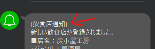

# 全国レストラン

## 事前準備

### Line Notify Tokenを取得

https://notify-bot.line.me/

|   | トークン名 | 用途 |
| - | --------- | ---- |
| ① | 飲食店通知 | 新規で飲食店が追加された際の通知 |
| ② | システムエラー通知 | 何かしらでエラーが発生した際の通知 |

※トークンの発行は1つでも問題ないが、Line Notifyの仕様で通知メッセージの1行目の文字列に設定されるので、2つ用意することを推奨



### ホットペッパーAPIキーを取得

https://webservice.recruit.co.jp/doc/hotpepper/reference.html

### GCPにてAPIキーを取得

https://console.cloud.google.com/?hl=ja

- 本番・開発用で作成（1つでも可）
- Geocoding APIを許可

### AWS Systems Managerパラメータストアへ登録

|   | 名前 | 種類 | 値 |
| - |---- | --- | -- |
| ① | basic_auth_base64 | SecureString | Basic認証をbase64エンコードした文字列<br>$ echo -n "username:password" \| base64 |
| ② | /line_notify/restaurants/token | SecureString | Line Notify Token①の値 |
| ③ | /line_notify/error_notify/token | SecureString | Line Notify Token②の値 |
| ④ | /restaurants/api_key/hotpepper | SecureString | ホットペッパーAPIキー |
| ⑤ | /google/geocoding/prod/key | SecureString | GCP APIキー（本番用） |
| ⑥ | /google/geocoding/dev/key | SecureString | GCP APIキー（開発用） |
| ⑦ | /sakura/restaurants/database_api_key | SecureString | さくらサーバー連携用APIキー |

※CloudFormationで`SecureStringのパラメータは作成できない`ため、手動で登録

### その他（割愛）
- aws cli, samのインストール
- 独自ドメインの取得
- Route53にてホストゾーンの作成
- ACMにてSSL証明書の作成
  - `*.独自ドメイン`の形で用意すること
  - リージョンは東京とバージニア北部で作成すること

### 開発用・本番用の環境設定ファイルを準備
```sh
# infeastructures, lambda_layers共に実施

# 開発環境
cp deploy.env.example deploy_dev.env

# 本番環境
cp deploy.env.example deploy_prod.env
```

## デプロイ

### infrastructuresとlambda_layersについて

- infrastructures
    - バックエンドはLambda関数のデプロイを兼任するため、実質はインフラとバックエンドを受け持つ

- lambda_layers
    - Lambda Layerのみinfrastructuresから切り離す
    - レイヤーはデプロイの度に新しいバージョンとなるため、レイヤーや関数に変更がなくてもsam deployの度に変更リストに上がり、レイヤーを使用しているLambda関数す全てが更新され、デプロイ所要時間が膨大となる
    ↓
    - レイヤーのデプロイ時に最新バージョンのARNをCloudformationに出力し、infrastructuresではそのARNを指定することで、改修がなければ変更リストに入らないようにする

- infrastructuresの場合の注意
    - 初回は`ApiGatewayBackendBasePathMapping`はコメントアウトした上でデプロイし、コメントアウトを外して再度デプロイを行うこと
        - API Gatewayが未作成の状態でマッピングを作成しようとして、エラーとなるため
        - 明示的に順番を指定する手段があれば、この問題は解決できそう

```sh
# infeastructures, lambda_layers共に実施

# 開発環境
bash deploy.sh dev

# 本番環境
bash deploy.sh prod
```

## Lambda関数へテストイベントの登録
```sh
# infeastructures

# 開発環境
bash set_lambda_test_events.sh dev
# 本番環境
bash set_lambda_test_events.sh prod
```

## さくらサーバー連携用APIユーザーのアクセスキーとシークレットを作成
- SAMではできないため、マネコンで手動で実施
  - APIユーザーはマネコンのアクセスを無効化しているので、別のユーザーで実施

## リソースを全て削除する場合
1. S3バケットを空にする
    - バケットは空にしてからでないと削除できないため
2. CloudFormationスタックを削除